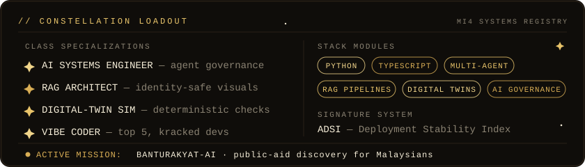

<div align="center">



<br><br>


<br><br>

*"Code is how stardust remembers it was once a star."*

</div>

---

```console
strdst7@orion-arm:~$ whoami

  Nur Amirah Mohd Kamil (Mia) — Founder & CEO, MI4 Inc.
  AI Systems Engineer · Vibe Coder · Kuala Lumpur, MY
  Building legendary AI systems, one constellation at a time.

strdst7@orion-arm:~$ cat mission.txt

  Make AI systems that stay stable, governable, and genuinely useful —
  from enterprise reliability frameworks to public-good platforms.
```

<br>

## ⭐ Stellar Progress

Every contribution is fusion fuel. **Level = √XP** (rolling 365 days), and levels map to real
[stellar classes](https://en.wikipedia.org/wiki/Stellar_classification) — from red dwarf `M` all the
way to hypergiant `O`. **Class `B` unlocks at LV 32** — the class of **Rigel (β Orionis, B8Ia)**,
the blue supergiant burning ~850 light-years away in Orion. Currently: **Rigel tier reached.** 🔵

<div align="center">

</div>

<sub>Auto-synced daily at 00:15 MYT by GitHub Actions. No external card services — this star chart lives entirely in this repo.</sub>

<br>

## 🛰️ Constellation Loadout

<div align="center">

</div>

<br>

## 🌌 Featured Missions

| Mission | Class | Log entry |
|---|---|---|
| [**ai-os**](https://github.com/strdst7/ai-os) | `AI GOVERNANCE` | Introduces **ADSI** — a composite Deployment Stability Index for monitoring and governing AI systems in production |
| [**ai-os-framework**](https://github.com/strdst7/ai-os-framework) | `MULTI-AGENT` | Multi-agent governance framework turning operational telemetry into enterprise AI reliability signals |
| [**BantuRakyat-AI**](https://github.com/strdst7/BantuRakyat-AI) | `AI FOR GOOD` | 🇲🇾 AI-powered platform helping Malaysians discover government aid programs and check eligibility |
| [**CCAM-for-Malaysian-SMEs**](https://github.com/strdst7/CCAM-for-Malaysian-SMEs) | `DIGITAL TWIN` | Simulation-driven automation that validates every workflow inside a deterministic digital twin before it ships |
| [**miva-studio**](https://github.com/strdst7/miva-studio) | `RAG` | Production-grade RAG architecture for identity-critical visual generation |
| [**Luth's playground**](https://github.com/strdst7/Luth-s-playground) | `EDTECH` | Learning that feels like play — with real insight and control for parents |

<br>

## 📡 Open a Channel

<div align="center">

[](https://www.aimirah.com)
[](https://github.com/strdst7)

<br>

✦ &nbsp; ✧ &nbsp; ⭐ &nbsp; ✧ &nbsp; ✦

**850 light-years to Rigel — and climbing.**

</div>
