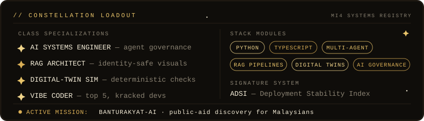

 

### I build AI systems that remain useful after the demo.

Governed agents · reliable RAG · digital twins · privacy-first creative tools

 

## Signal

I'm **Nur Amirah Mohd Kamil (Mia)**, an AI Systems Engineer and the Founder & CEO of **MI4 Inc.**, based in Kuala Lumpur, Malaysia. I work where applied AI meets systems thinking: designing agent architectures, governance layers, retrieval systems, and human-centered products that are stable, explainable, and genuinely useful.

My projects move between enterprise AI reliability and public-good technology, with one constant: intelligence should be engineered as a dependable system—not added as a decorative feature.

> *“Code is how stardust remembers it was once a star.”*

## Currently in orbit

- 🪞 Building **[Trueframe](https://strdst7.github.io/true-frame/)**, a private, on-device studio that makes AI imagery feel more photographic.
- 🛰️ Developing **[AI-OS](https://github.com/strdst7/ai-os)** and the **[AI-OS Framework](https://github.com/strdst7/ai-os-framework)** for measurable deployment stability and multi-agent governance.
- 🇲🇾 Exploring AI for public access through **[BantuRakyat-AI](https://github.com/strdst7/BantuRakyat-AI)** and simulation-led automation for Malaysian SMEs.

## Selected systems

| Project | Domain | What it does |
| --- | --- | --- |
| [**Trueframe**](https://github.com/strdst7/true-frame) · [Live](https://strdst7.github.io/true-frame/) | `CREATIVE AI` | Six browser-native tools for skin repair, upscaling, film grading, prompt design, and batch processing—with no uploads |
| [**AI-OS**](https://github.com/strdst7/ai-os) | `AI GOVERNANCE` | Introduces ADSI, a composite stability model for monitoring and governing production AI deployments |
| [**AI-OS Framework**](https://github.com/strdst7/ai-os-framework) | `MULTI-AGENT` | Converts operational telemetry into stability scores, risk tiers, anomaly signals, and governance decisions |
| [**CCAM for Malaysian SMEs**](https://github.com/strdst7/CCAM-for-Malaysian-SMEs) | `DIGITAL TWIN` | Validates automation workflows inside a deterministic simulation before they reach real operations |
| [**BantuRakyat-AI**](https://github.com/strdst7/BantuRakyat-AI) · [Live](https://bantu-rakyat-ai.vercel.app) | `AI FOR GOOD` | Helps Malaysians discover government assistance programs and understand their eligibility |
| [**ReadyTensor RAG Assistant**](https://github.com/strdst7/readytensor-rag-assistant) | `RAG` | A FastAPI, LangChain, and Streamlit assistant for context-aware publication discovery |

## Constellation loadout

### Core tools

`Python` · `TypeScript` · `JavaScript` · `FastAPI` · `React` · `LangChain` · `Streamlit` · `Docker` · `GitHub Actions` · `Google Cloud`

### Systems focus

`Multi-agent architectures` · `RAG pipelines` · `AI governance` · `Digital twins` · `Evaluation` · `Observability` · `Privacy-first applications`

## Engineering principles

- **Reliability is a product feature.** AI systems need measurable behavior, recovery paths, and operational guardrails.
- **Validate before reality pays the price.** Simulation and deterministic checks belong before deployment.
- **Privacy should be architectural.** When a task can run locally, user data should stay local.
- **Useful beats impressive.** The best system solves a real problem clearly and survives contact with its users.

## Stellar telemetry

 

<picture>
  <source media="(prefers-color-scheme: dark)" srcset="https://github-readme-stats.vercel.app/api?username=strdst7&show_icons=true&theme=dark&hide_border=true&title_color=E9C46A&icon_color=E9C46A&text_color=f4f2dd&bg_color=0A0908" />
  
</picture>

 

<picture>
  <source media="(prefers-color-scheme: dark)" srcset="https://github-readme-streak-stats.herokuapp.com?user=strdst7&theme=dark&hide_border=true&stroke=0A0908&ring=E9C46A&fire=E9C46A&currStreakLabel=E9C46A&background=0A0908" />
  
</picture>

 

<picture>
  <source media="(prefers-color-scheme: dark)" srcset="https://github-readme-stats.vercel.app/api/top-langs/?username=strdst7&layout=compact&theme=dark&hide_border=true&title_color=E9C46A&text_color=f4f2dd&bg_color=0A0908" />
  
</picture>

Generated from this profile's contribution data and refreshed daily by GitHub Actions.

<h2>📬 Open a channel</h2>

 

I'm open to conversations about **dependable AI systems**, **agent governance**, **applied RAG**, **creative technology**, and **mission-driven products**.

 

 

✦ &nbsp; *Building useful intelligence from the Orion arm.* &nbsp; ✦

---

📌 This profile is also a live, interactive single-page systems board — rendered from the same design language. Ask for the link.
